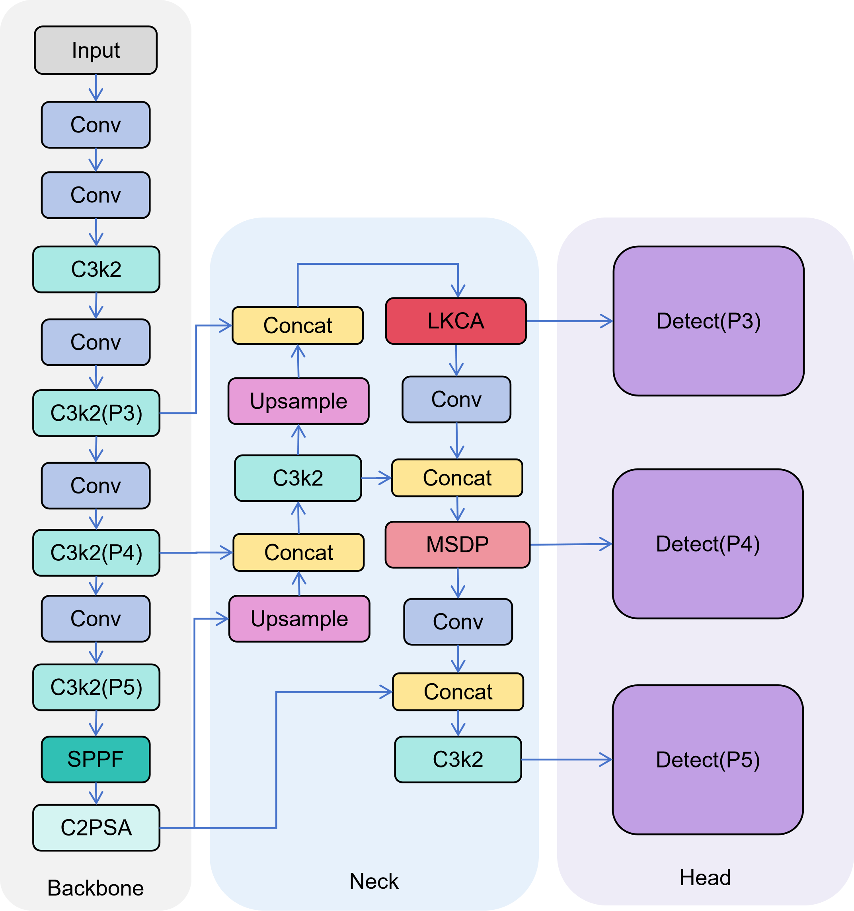

# LMW-YOLO: Lightweight Model for Small Object Detection in Remote Sensing Images

This repository contains the official PyTorch implementation of the paper: **"Lightweight model LMW-YOLO for small object detection in remote sensing images"** (Under Review at *Scientific Reports*).

**Please remember to add the datasets on your own before running the code.**

## 🚀 Introduction
Detecting small objects in remote sensing images is challenging due to complex backgrounds and extreme scale variations. We propose **LMW-YOLO**, a lightweight object detection model. 
Key components include:
* **LKCA (Large-Kernel Context Aggregation)** module for shallow layers.
* **MSDP (Multi-Scale Dilated Perception)** module for deep layers.
* **CSD (Context-Scale Decoupled)** strategy.
* **WIoU v3** loss function.

